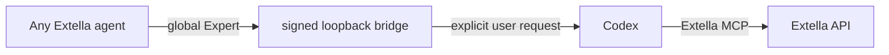

# Extella ↔ Codex Bridge

A standalone, open-source integration that connects Codex and Extella in both directions:

- **Codex → Extella:** Codex uses Extella MCP with each user's own credentials.
- **Extella → Codex:** any current or future Extella agent can explicitly delegate a bounded task to the user's local Codex.

The repository is the canonical home for the bridge runtime, the account-wide Extella Expert, the Codex plugin, and the Extella Desktop button integration.



## Install the Codex plugin

```bash
codex plugin marketplace add AnvarBakiyev/extella-codex-bridge --ref v0.1.0
codex plugin add extella-codex-bridge@extella-codex
```

Codex then asks the user to authenticate the Extella MCP connection. Credentials are referenced through environment variables and are never stored in this repository.

## Extella Desktop one-button flow

The product button performs an idempotent setup:

1. verifies Codex and Extella locally without calling a model;
2. installs the signed loopback runtime on macOS;
3. derives an account binding from the current Extella account;
4. ensures the global Expert `extella_codex_account_bridge_v2` is available;
5. makes the bridge available to all current and future agents;
6. verifies the resulting configuration without a paid model call.

The reusable UI integration is in [`plugins/extella-codex-bridge/integrations/extella-desktop`](plugins/extella-codex-bridge/integrations/extella-desktop/README.md).

## Calling Codex from Extella

When the user explicitly asks to call Codex, Extella should invoke the global Expert directly:

```text
run_expert(
  name="extella_codex_account_bridge_v2",
  global=true,
  params={"prompt": "...", "max_output_tokens": 2000, "timeout_ms": 120000}
)
```

Do not use `run_agent` for this route. The bridge Expert is the tool boundary; the requesting agent's own model provider key is not needed by the local Codex bridge.

## Cost behavior

- Installation, health checks, and configuration verification do **not** call an Extella agent or Codex model.
- A real bridge request can consume the user's Codex/ChatGPT plan or configured OpenAI API usage.
- Normal Extella agent execution follows the user's Extella plan.
- `max_output_tokens` is a post-execution usage guard. The current supported maximum is 2000.

## Local development

```bash
cd plugins/extella-codex-bridge
npm test
```

The test suite uses the mock provider and a fake Codex executable. It does not call a paid model.

Current persistent-runtime support is macOS. The protocol and provider adapter are platform-neutral; Windows and Linux service installers can be added separately.
